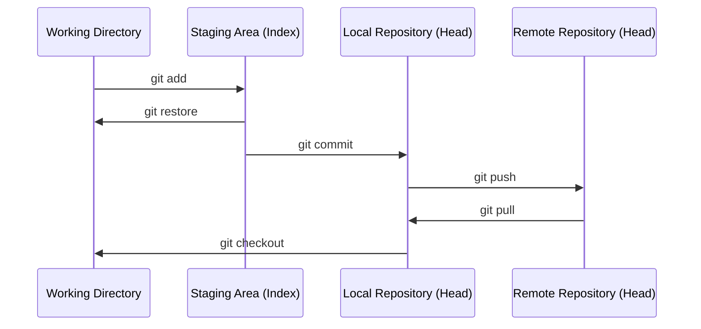

# 3. Áreas y flujo de trabajo

Git organiza el trabajo en **cuatro áreas**. Entender el paso de una a otra es la base para trabajar con Git.



## 1. Working Directory (directorio de trabajo)

Son los archivos tal y como los ves y editas en tu sistema de archivos. Aquí es donde creas, modificas o borras archivos.

```bash
git status
```
Muestra qué archivos han cambiado respecto al último commit y en qué área se encuentran.

## 2. Staging Area (índice)

Zona intermedia donde se "preparan" los cambios que queremos incluir en el próximo commit. Permite hacer commits **selectivos** (no todo lo modificado tiene por qué ir junto).

```bash
git add archivo.txt      # añade un archivo concreto
git add .                # añade todos los cambios
```

Para sacar un archivo del staging sin perder los cambios:

```bash
git restore --staged archivo.txt
```

## 3. Local Repository (repositorio local)

Al hacer `commit`, los cambios en staging quedan **guardados permanentemente** en el historial local, junto a un mensaje descriptivo y el autor (configurado con `user.name`/`user.email`).

```bash
git commit -m "Mensaje descriptivo del cambio"
```

Cada commit genera un identificador único (hash) y referencia al commit anterior, formando una cadena (el historial).

## 4. Remote Repository (repositorio remoto)

Copia del repositorio alojada en un servidor (GitHub, GitLab...) que permite compartir el trabajo con otras personas. Ver [Repositorio remoto](5.%20Repositorio%20remoto.md) para más detalle.

```bash
git push   # sube commits locales al remoto
git pull   # trae y fusiona los cambios del remoto
```

## Resumen de comandos

| Comando           | De → A                                   |
| ------------------ | ----------------------------------------- |
| `git add`           | Working Directory → Staging Area          |
| `git restore --staged` | Staging Area → Working Directory       |
| `git commit`        | Staging Area → Local Repository           |
| `git push`          | Local Repository → Remote Repository      |
| `git pull`          | Remote Repository → Local Repository      |
| `git checkout` / `git restore` | Local Repository → Working Directory |

---

[← Instalación y configuración](2.%20Instalacion%20y%20configuracion.md){ .md-button } [Siguiente: Ramas →](4.%20Ramas.md){ .md-button }
