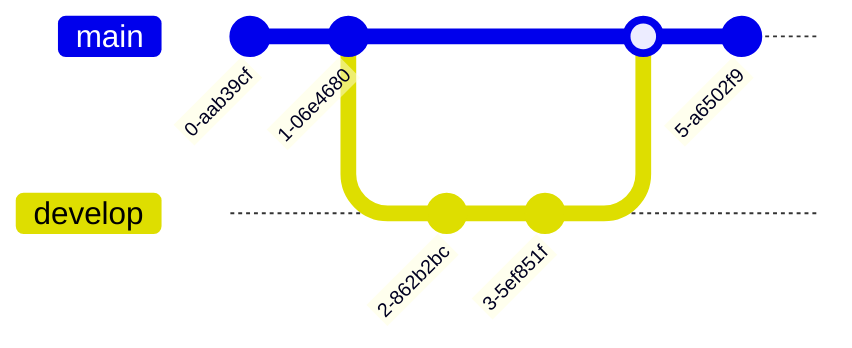

# 4. Ramas

Una **rama (branch)** es una línea de desarrollo independiente. Permiten trabajar en nuevas funcionalidades o correcciones sin afectar al código estable (normalmente en la rama `main`).



## Crear una rama

```bash
git branch nueva-rama       # crea la rama
git checkout nueva-rama     # cambia a esa rama
```

Atajo para crear y cambiar en un solo paso:

```bash
git checkout -b nueva-rama
# o, con el comando moderno:
git switch -c nueva-rama
```

## Listar y cambiar de rama

```bash
git branch          # lista ramas locales
git branch -a       # incluye ramas remotas
git switch main     # cambiar a la rama main
```

## Fusionar ramas (merge)

Para incorporar los cambios de una rama en otra (por ejemplo, llevar `develop` a `main`):

```bash
git switch main
git merge develop
```

Si ambas ramas modificaron las mismas líneas de un archivo, Git no puede decidir automáticamente y aparece un **conflicto de merge**. Hay que editar el archivo a mano, elegir qué contenido se queda y confirmar:

```bash
git add archivo-en-conflicto.txt
git commit
```

## Eliminar una rama

Una vez fusionada y ya no se necesita:

```bash
git branch -d nombre-rama     # borrado seguro (solo si ya está fusionada)
git branch -D nombre-rama     # borrado forzado
```

## Buenas prácticas

- `main` (o `master`) debe contener siempre código estable/funcional.
- Crear una rama por funcionalidad o corrección (`feature/login`, `fix/error-login`).
- Fusionar mediante **Pull Request** en el remoto para revisar cambios antes de integrarlos.

---

[← Áreas y flujo de trabajo](3.%20Areas%20y%20flujo%20de%20trabajo.md){ .md-button } [Siguiente: Repositorio remoto →](5.%20Repositorio%20remoto.md){ .md-button }
