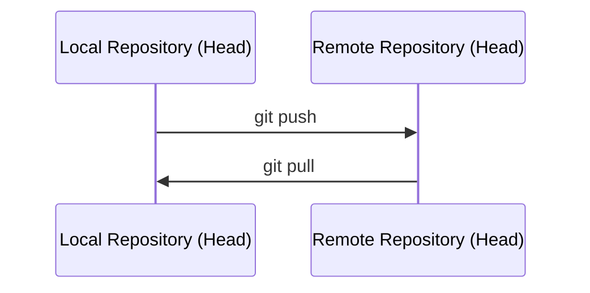

# 5. Repositorio remoto

Un **repositorio remoto** es una copia del proyecto alojada en un servidor (GitHub, GitLab, Bitbucket...). Permite:

- Hacer copia de seguridad del proyecto fuera del equipo local.
- Colaborar con otras personas.
- Desplegar el código desde un único origen compartido (útil en CI/CD).



## Conectar un repositorio local a un remoto

```bash
git remote add origin https://github.com/usuario/proyecto.git
```

- `origin` es el nombre por convención del remoto principal (puede ser cualquier nombre).

Comprobar remotos configurados:

```bash
git remote -v
```

## Clonar un repositorio existente

Si el repositorio ya existe en el servidor, en vez de `init` + `remote add`, se usa:

```bash
git clone https://github.com/usuario/proyecto.git
```

Esto descarga el proyecto completo (con historial) y configura automáticamente `origin`.

## Subir cambios (push)

```bash
git push origin main
```

La primera vez puede ser necesario indicar la rama de seguimiento (*upstream*):

```bash
git push -u origin main
```
A partir de ahí, basta con `git push`.

## Descargar cambios (pull)

```bash
git pull origin main
```

Internamente, `git pull` = `git fetch` (descarga cambios) + `git merge` (los fusiona con tu rama local).

## Autenticación

GitHub ya no permite usar la contraseña de la cuenta directamente; hace falta:

- **Token de acceso personal (HTTPS)**, o
- **Clave SSH** configurada en la cuenta.

```bash
ssh-keygen -t ed25519 -C "correo@ejemplo.com"
```
La clave pública generada se añade en GitHub → *Settings* → *SSH and GPG keys*.

---

[← Ramas](4.%20Ramas.md){ .md-button } [Siguiente: Revertir cambios →](6.%20Revertir%20cambios.md){ .md-button }
