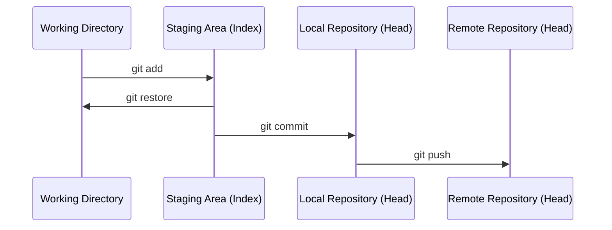

# 6. Revertir cambios

Git ofrece distintos comandos según **dónde** estén los cambios que queremos deshacer.



## Revertir cambios en el Working Directory

Descartar cambios no añadidos al staging (vuelve al último commit):

```bash
git restore archivo.txt
```

## Sacar archivos del Staging Area

Si se hizo `git add` pero no queremos incluirlo en el commit:

```bash
git restore --staged archivo.txt
```

## Revertir un commit local

Dos estrategias distintas:

### `git reset` — reescribe el historial

```bash
git reset --soft HEAD~1    # deshace el commit, mantiene cambios en staging
git reset --mixed HEAD~1   # deshace el commit, mantiene cambios en working dir (por defecto)
git reset --hard HEAD~1    # deshace el commit y BORRA los cambios (¡irreversible!)
```

!!! warning
    No usar `reset` sobre commits ya subidos (`push`) a un remoto compartido: reescribe el historial y genera conflictos a otros colaboradores.

### `git revert` — crea un commit inverso

```bash
git revert <hash-del-commit>
```

En vez de eliminar el commit, crea uno **nuevo** que deshace los cambios. Es la opción segura cuando el commit ya se ha compartido (`push`).

## Revertir un push ya subido al remoto

Si el commit ya está en el remoto, la opción recomendada es `revert` + `push`:

```bash
git revert <hash-del-commit>
git push origin main
```

Si es imprescindible reescribir el historial remoto (por ejemplo, se subió información sensible):

```bash
git reset --hard <hash-commit-anterior>
git push --force origin main
```

!!! danger "Cuidado con `--force`"
    Sobrescribe el historial remoto. Cualquier colaborador que ya tuviera los commits eliminados tendrá conflictos graves. Usar solo si es estrictamente necesario y avisando al equipo.

---

[← Repositorio remoto](5.%20Repositorio%20remoto.md){ .md-button } [Siguiente: Visualización del proyecto →](7.%20Visualizacion.md){ .md-button }
