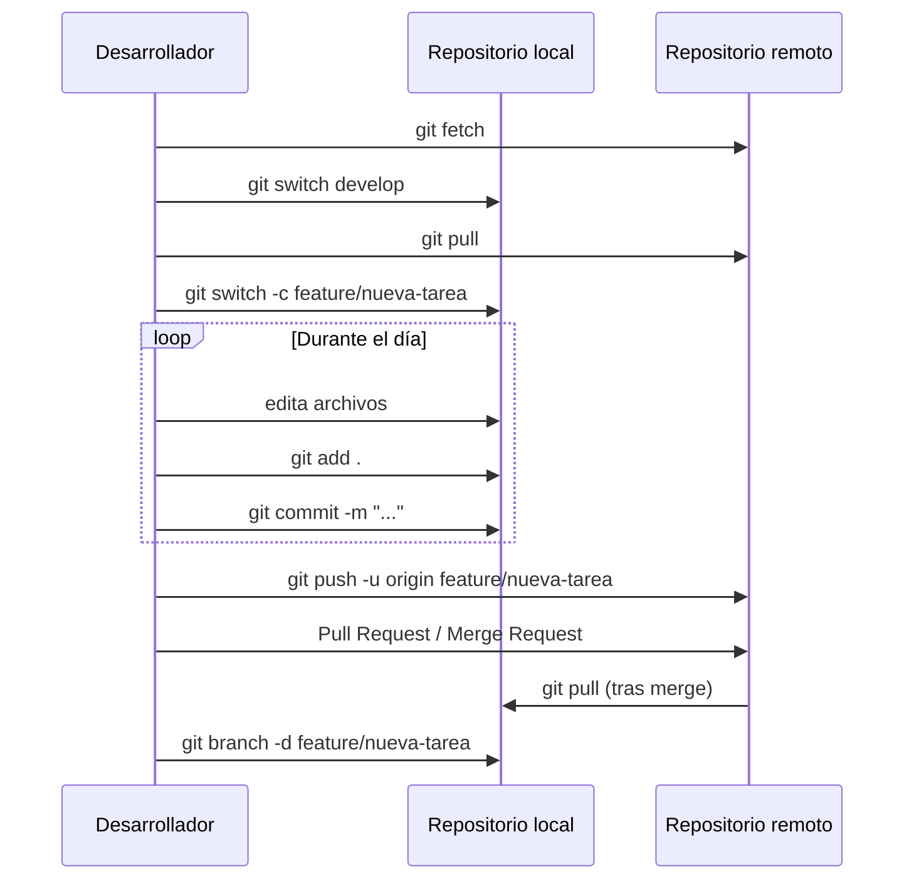

# 8. Cheatsheet: flujo diario de trabajo

Resumen práctico de los comandos que un desarrollador suele ejecutar durante una jornada de trabajo con Git.



## 1. Empezar el día

Antes de tocar nada, comprobar que tenemos la última versión del proyecto:

```bash
git fetch                 # descarga referencias del remoto sin fusionar nada
git status                # comprobar que no hay cambios pendientes
git switch develop        # ir a la rama de desarrollo
git pull                  # traer y fusionar los últimos cambios
```

!!! note "`fetch` vs `pull`"
    `git fetch` solo **descarga** información del remoto (no toca tu working directory). `git pull` = `fetch` + `merge`. Es buena práctica hacer `fetch` primero para revisar qué ha cambiado antes de fusionar.

## 2. Crear una rama para la tarea del día

```bash
git switch -c feature/nombre-tarea
```

## 3. Ciclo de trabajo (repetir cuantas veces sea necesario)

```bash
git status                     # ver qué ha cambiado
git diff                       # revisar los cambios en detalle
git add .                      # o git add archivo.txt para ser más selectivo
git commit -m "Mensaje claro y breve"
```

## 4. Subir el trabajo al remoto

```bash
git push -u origin feature/nombre-tarea   # primera vez
git push                                  # siguientes veces
```

## 5. Mantener la rama actualizada con `develop`

Si la tarea se alarga varios días, conviene traer los cambios de `develop` para evitar conflictos grandes al final:

```bash
git switch develop
git pull
git switch feature/nombre-tarea
git merge develop
```

## 6. Finalizar la tarea

1. Abrir un **Pull Request / Merge Request** en la plataforma (GitHub/GitLab).
2. Revisión de código por parte de otro compañero.
3. Fusionar (`merge`) la rama en `develop`.
4. Eliminar la rama, ya innecesaria:

```bash
git switch develop
git pull
git branch -d feature/nombre-tarea
git push origin --delete feature/nombre-tarea
```

## Chuleta rápida de comandos

| Momento del día         | Comando                                  |
| ------------------------ | ------------------------------------------ |
| Llegar por la mañana      | `git fetch` · `git pull`                  |
| Empezar tarea nueva        | `git switch -c feature/tarea`             |
| Guardar avances            | `git add .` · `git commit -m "..."`       |
| Compartir avances          | `git push`                                |
| Actualizar con `develop`   | `git merge develop` (desde la feature)    |
| Terminar tarea             | Pull Request → merge → `git branch -d`    |
| Consultar antes de tocar   | `git status` · `git log --oneline`        |

---

[← Visualización del proyecto](7.%20Visualizacion.md){ .md-button } [Siguiente: Arquitectura main/dev/feature →](9.%20Arquitectura%20main-dev-feature.md){ .md-button }
