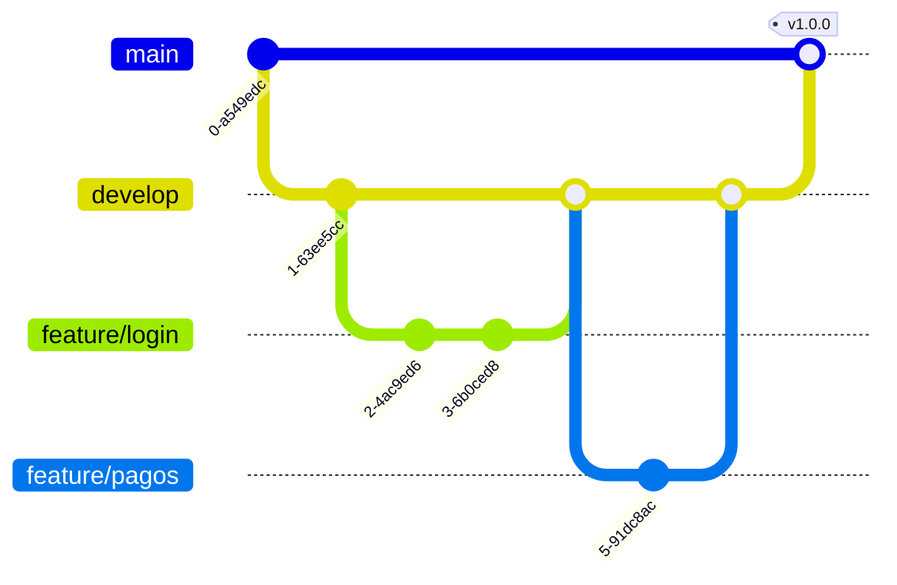
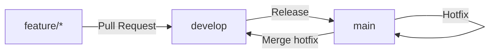

# 9. Arquitectura main / develop / feature

Estrategia de ramificación muy usada en equipos profesionales, simplificación de **Git Flow**. Separa el código según su nivel de estabilidad.



## Las tres ramas principales

| Rama          | Propósito                                                        | ¿Quién hace commits directamente? |
| ------------- | ------------------------------------------------------------------ | ------------------------------------ |
| `main`        | Código **en producción**. Siempre estable y desplegable.           | Nadie (solo vía merge desde `develop`) |
| `develop`     | Integración de funcionalidades ya terminadas. Rama "candidata" a la siguiente versión. | Nadie (solo vía merge desde `feature/*`) |
| `feature/*`   | Desarrollo de una funcionalidad o corrección concreta.              | El desarrollador asignado a la tarea |

!!! note "¿Por qué no trabajar directamente en `main` o `develop`?"
    Si varios desarrolladores modifican `develop` directamente, es fácil romper el trabajo de otros. Aislando cada tarea en su propia rama `feature/*`, los cambios solo se integran cuando están terminados y revisados.

## Flujo de trabajo completo

### 1. Crear una rama feature desde `develop`

```bash
git switch develop
git pull
git switch -c feature/carrito-compra
```

Convención de nombres habitual: `feature/<descripción-corta>`, `fix/<descripción-corta>`, `hotfix/<descripción-corta>`.

### 2. Trabajar y subir la rama

```bash
git add .
git commit -m "Añade lógica del carrito de compra"
git push -u origin feature/carrito-compra
```

### 3. Integrar en `develop`

Cuando la funcionalidad está terminada, se abre un **Pull Request** de `feature/carrito-compra` → `develop`. Tras la revisión y aprobación:

```bash
git switch develop
git pull
git merge feature/carrito-compra
git push
```

### 4. Pasar de `develop` a `main` (release)

Cuando `develop` acumula suficientes funcionalidades probadas para una nueva versión:

```bash
git switch main
git pull
git merge develop
git tag -a v1.0.0 -m "Primera versión estable"
git push origin main --tags
```

### 5. Hotfix urgente en producción

Si aparece un error crítico en `main` que no puede esperar al ciclo normal de `develop`:

```bash
git switch main
git switch -c hotfix/error-login
# corregir el error
git commit -m "Corrige error de login"
git switch main
git merge hotfix/error-login
git push

git switch develop
git merge hotfix/error-login   # para que el fix no se pierda en la siguiente release
git push
```

## Resumen visual del ciclo de vida



## Buenas prácticas

- Nunca hacer commits directamente en `main` ni `develop`.
- Mantener las ramas `feature/*` de corta duración (días, no semanas) para minimizar conflictos.
- Usar **Pull Requests** con revisión de código antes de fusionar.
- Etiquetar (`tag`) cada versión que llega a `main` para poder identificarla fácilmente.
- Borrar las ramas `feature/*` una vez fusionadas.

---

[← Cheatsheet](8.%20Cheatsheet.md){ .md-button } [Volver al índice](1.%20Git.md){ .md-button }
