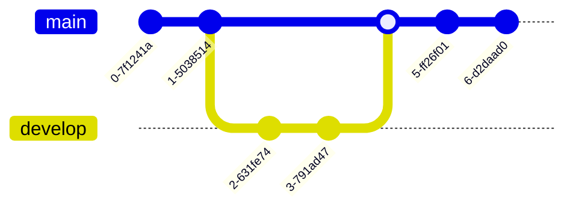
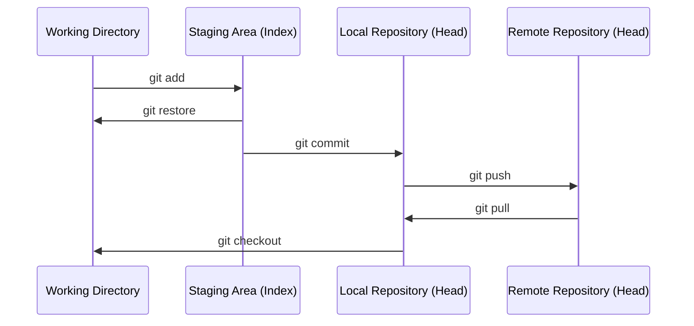

# 1. Git

Git es un **sistema de control de versiones distribuido**: permite registrar el historial de cambios de un proyecto, trabajar en paralelo con otras personas y volver atrás si algo sale mal.

En esta unidad veremos:

1. [Instalación y configuración](2.%20Instalacion%20y%20configuracion.md)
2. [Áreas y flujo de trabajo](3.%20Areas%20y%20flujo%20de%20trabajo.md)
3. [Ramas](4.%20Ramas.md)
4. [Repositorio remoto](5.%20Repositorio%20remoto.md)
5. [Revertir cambios](6.%20Revertir%20cambios.md)
6. [Visualización del proyecto](7.%20Visualizacion.md)

## Ejemplo de flujo con ramas

## Ejemplo de flujo entre áreas

[Empezar: Instalación y configuración →](2.%20Instalacion%20y%20configuracion.md){ .md-button }
