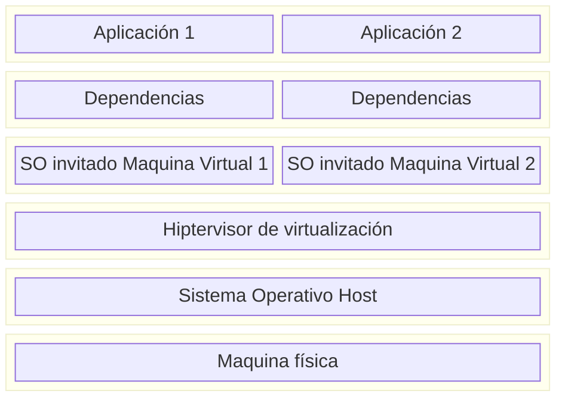
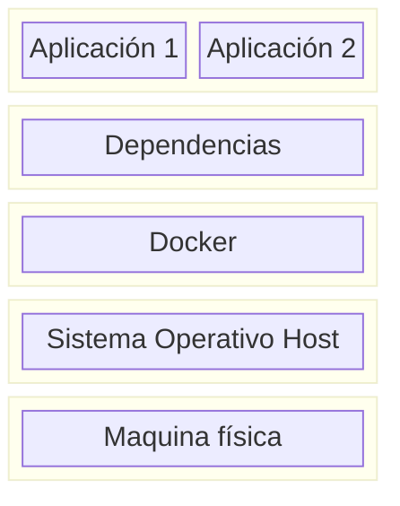

# Docker
### ¿Qué es Docker?
Docker es un conjunto de herramientas que facilitan la implantación de despliegues informáticos como si fuera una virtualización ligera. Cuando hablamos de **virtualización**, hablamos del conjunto de tecnologías que nos permiten dividir un conjunto de recursos físicos (hardware) en recursos virtuales que pueden ser máquinas virtuales, sistemas operativos, procesos o contenedores.

En un sistema de virtualización tradicional (como podría ser Oracle VirtualBox)

Como se ve en la representación, cada Máquina Virtual (a partir de ahora VM) requiere la reinstalación de su propio SO completo, la cual cosa dificulta la creación y destrucción ágil de máquinas virtuales. Además, en un entorno industrial raramente se utiliza la virtualización para desplegar diferentes SO en un mismo soporte físico, por lo que la redundancia que implica la instalación de dos SO idénticos en dos VM supone un desperdicio de recursos.

Además, normalmente la instalación de Sistemas Operativos completos implica asignar recursos a componentes que probablemente no se vayan a usar nunca (por ejemplo, componentes de Bluetooth y Wifi, software de GPU dedicada, drivers de sonido y periféricos físicos etc.)

Actualmente, los hipervisores son capaces de poner en común fragmentos de las ímagenes de las VM para optimizar el proceso. Sin embargo, las VM requerirán de su propio espacio en memoria RAM para el arranque y 

Para solucionar este problema, nacen los **contenedores**. Los contenedores son una solución **ligera** a la virtualización. 

Cuando el SO de las máquinas virtualizadas o gran parte de el se comparte con el SO del host, una solución más eficiente que la que hemos visto de Virtualización tradicional sería que las Máquinas Virtuales puedan acceder a las funcionalidades comunes del SO host. 

Éste mecanismo de utilización del núcleo de SO Host es el que nos permite ahorrar recursos y espacio ya que, si por ejemplo tenemos en nuestro sistema host Ubuntu y queremos crear un contenedor con Docker basado en Debian, no realizará la instalación de todo el SO. 

> El sistema operativo se compone, de manera simplificada, por dos componentes: El núcleo (**kernel**) y el Espacio de Usuario (**Userland**). El núcleo es el que gestiona la memoria, la cpu, las llamadas al sistema etc. El Userland es el conjunto de archivos, librerías y utilidades que hacen que "Ubuntu sea Ubuntu" (`/bin`, `/usr`). La diferencia es que una instalación de Debian completa ocupa de ~1Gb a 1.5Gb en un servidor mínimo y el Userspace puede ocupar en su versión slim de ~30Mb a 80Mb.

Es importante remarcar que los contenedores de Docker, pese a hacer uso de utilidades del Kernel del SO Host, están complétamente aisladas. Es decir, que un contenedor nunca podrá acceder a la información del SO Host ni de otros contenedores.