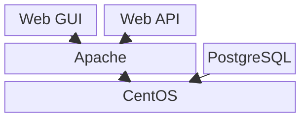

# 2. Docker

Docker es una plataforma que permite empaquetar aplicaciones junto a sus dependencias en **contenedores**, unidades ligeras y portables que se ejecutan igual en cualquier entorno.

En esta unidad veremos:

1. [Introducción](2.%20Introducci%C3%B3n.md)

## Ejemplo de arquitectura en capas

[Empezar: Introducción →](2.%20Introducci%C3%B3n.md){ .md-button }
