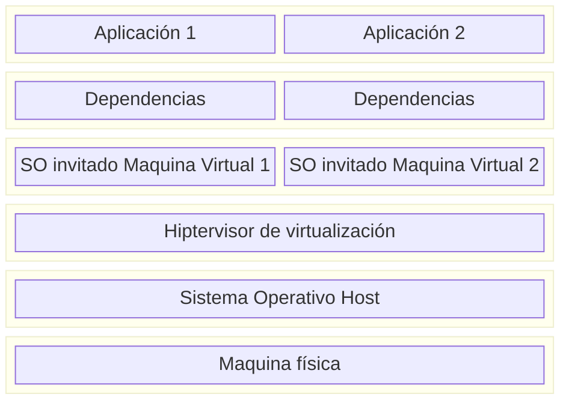
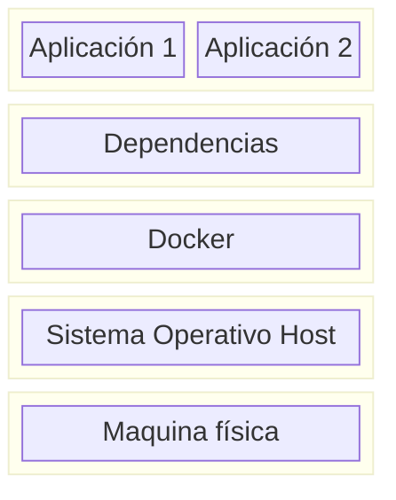
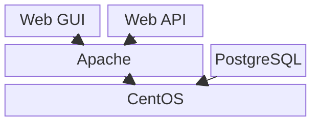

# Docker

## ¿Qué es Docker?

Docker es un conjunto de herramientas que facilita el despliegue de aplicaciones mediante una forma de **virtualización ligera**: los contenedores.

> **Virtualización**: conjunto de tecnologías que permiten dividir un conjunto de recursos físicos (hardware) en recursos virtuales, como máquinas virtuales, sistemas operativos, procesos o contenedores.

## Virtualización tradicional vs. contenedores

### Virtualización tradicional

En un sistema de virtualización tradicional (por ejemplo, Oracle VirtualBox), cada máquina virtual necesita su propio sistema operativo completo:

Como se ve en la representación, cada Máquina Virtual (a partir de ahora **VM**) requiere la reinstalación de su propio SO completo, lo cual dificulta la creación y destrucción ágil de máquinas virtuales.

**Problemas de este enfoque:**

- En un entorno industrial raramente se necesita desplegar diferentes SO en un mismo soporte físico, por lo que instalar dos SO idénticos en dos VM supone un **desperdicio de recursos**.
- Instalar un SO completo implica asignar recursos a componentes que probablemente no se usarán nunca (Bluetooth, Wifi, GPU dedicada, drivers de sonido, periféricos físicos, etc.).
- Aunque los hipervisores actuales pueden compartir fragmentos de las imágenes de las VM para optimizar el proceso, cada VM sigue necesitando su **propio espacio en memoria RAM** para arrancar y funcionar.

### La solución: contenedores

Para resolver estos problemas nacen los **contenedores**, una solución **ligera** a la virtualización.

La idea clave es: si gran parte del SO de las máquinas virtualizadas puede compartirse con el SO del host, entonces las aplicaciones podrían acceder directamente a las funcionalidades comunes del SO host en lugar de duplicarlas:

Éste mecanismo de utilización del núcleo de SO Host es el que nos permite ahorrar recursos y espacio, ya que, si por ejemplo tenemos en nuestro sistema host Ubuntu y queremos crear un contenedor con Docker basado en Debian, no realizará la instalación de todo el SO.

!!! note "Kernel vs. Userland"
    El sistema operativo se compone, de manera simplificada, de dos partes:

    - **Núcleo (kernel)**: gestiona la memoria, la CPU, las llamadas al sistema, etc.
    - **Espacio de usuario (userland)**: conjunto de archivos, librerías y utilidades que hacen que "Ubuntu sea Ubuntu" (`/bin`, `/usr`).

    Una instalación completa de Debian ocupa entre 1 GB y 1.5 GB en un servidor mínimo, mientras que su userland en versión *slim* puede ocupar solo entre 30 MB y 80 MB.

!!! warning "Aislamiento"
    Aunque los contenedores usan utilidades del kernel del SO host, están **completamente aislados**: un contenedor nunca podrá acceder a la información del SO host ni de otros contenedores.

## Comparativa: VM vs. contenedores

| Aspecto                  | Máquina Virtual (VM)              | Contenedor (Docker)                  |
|---------------------------|------------------------------------|----------------------------------------|
| Sistema Operativo          | Completo por cada VM               | Comparte el kernel del host            |
| Peso                      | Varios GB                          | Decenas/cientos de MB                  |
| Tiempo de arranque         | Minutos                            | Segundos                               |
| Aislamiento               | Total (a nivel de hardware virtual)| A nivel de proceso, pero seguro        |
| Uso de recursos            | Alto (RAM, CPU dedicados)          | Bajo (recursos compartidos con el host)|

## Imágenes y capas

Los contenedores en la práctica utilizan **imágenes**, que son paquetes de archivos que contienen todo lo necesario para ejecutar una aplicación: código fuente, entorno de ejecución, librerías, variables de entorno y archivos de configuración.

La **imagen es la plantilla con la que se crean los contenedores**. Por ejemplo, a partir de una única imagen `debian:slim` se pueden crear decenas de contenedores independientes entre sí.

> Una buena analogía: la imagen es como una clase en Java, y cada contenedor es una instancia de esa clase.

Las imágenes de Docker no son un único archivo gigante, sino que se construyen mediante **capas superpuestas** que se añaden unas a otras. Esto permite crear múltiples imágenes distintas que solo se diferencian en unos pocos archivos: en vez de duplicar los archivos de todo el SO, basta con superponer una capa con los cambios necesarios.

### Ejemplo práctico

Imaginemos que queremos desplegar una aplicación que usa PostgreSQL como base de datos, mientras que el frontend y los servicios (API) se sirven mediante Apache. Toda esta estructura se quiere montar sobre CentOS.

- Con **VM tradicionales**, habría que crear tres máquinas con CentOS desde cero y configurar cada una por completo.
- Con **contenedores y capas**, la estructura quedaría así:

Las imágenes se construyen añadiendo todas las capas inferiores. Por ejemplo, para construir la imagen de **Web GUI**:

1. Se parte de la imagen base de CentOS.
2. Se añade la capa de Apache (el archivo `apache2.conf`, los binarios en `/usr/sbin`, etc.).
3. Se añade la capa propia de Web GUI (archivos `.html`, scripts JavaScript, hojas de estilo `.css`).

Para **Web API** el proceso es análogo. De esta forma, crear la imagen de Web GUI o Web API solo implica añadir esa última capa ligera con unos pocos archivos, reutilizando todo lo demás.

Si además la configuración de Apache debe ser distinta entre Web GUI y Web API (por ejemplo, porque cada una necesita módulos diferentes), basta con incluir en cada imagen su propia versión del archivo `apache2.conf`: al ser una capa superior, **sobrescribirá** la versión heredada de la capa inferior.

---

[← Volver al índice](1.%20Docker.md){ .md-button }

