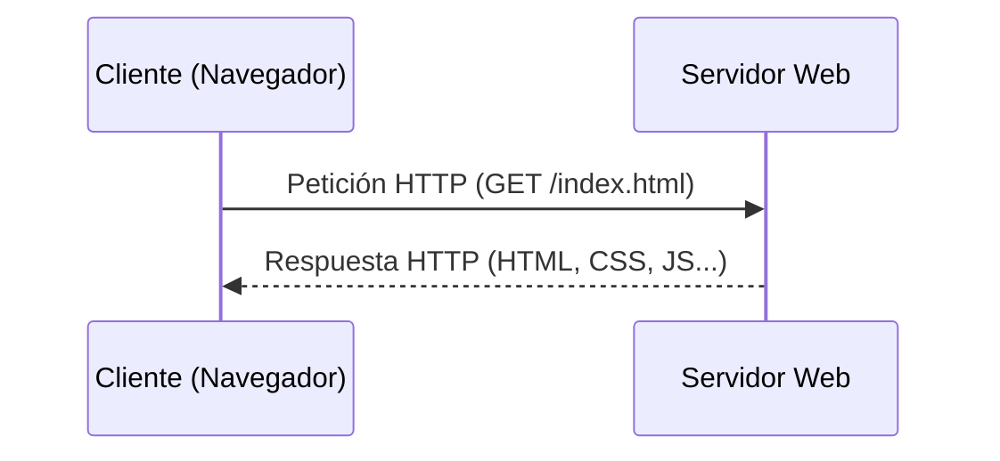
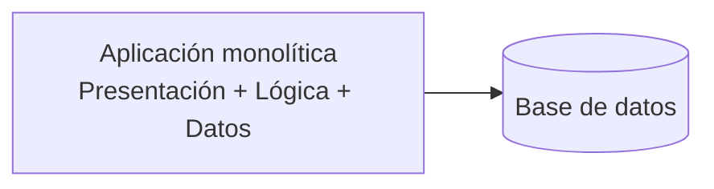
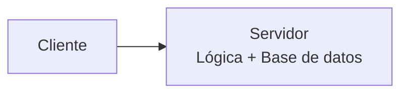
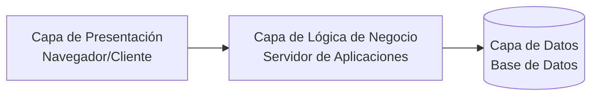
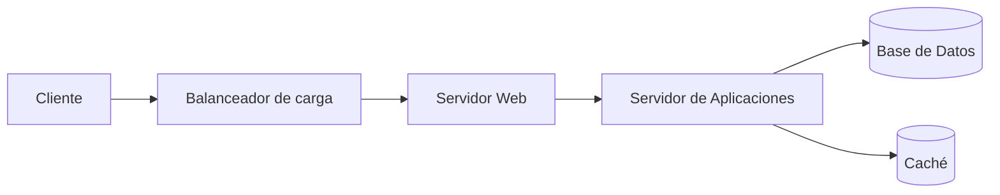
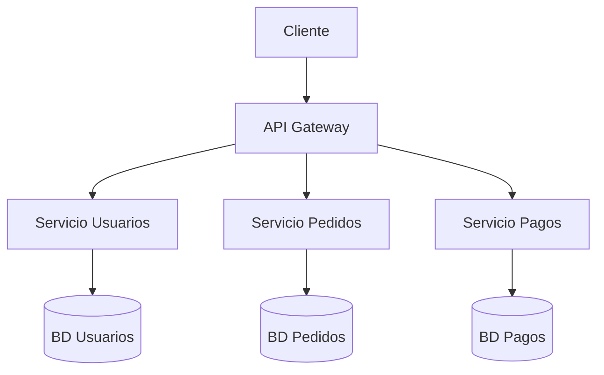
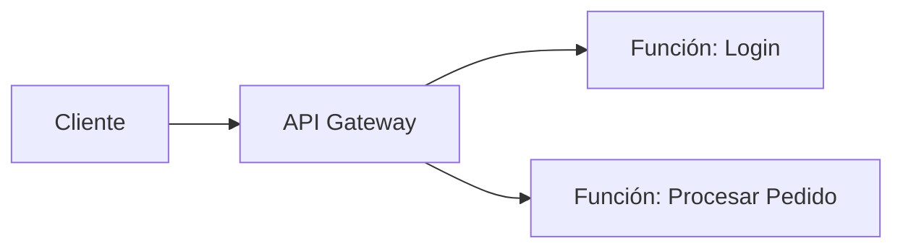

# Introducción

En éste módulo haremos una introducción al despliegue de aplicacions. Repasaremos conceptos ya conocidos como qué es un servidor, qué es una VPS, qué es SSH y como se puede uno conectar a otras máquinas. 

Después, conoceremos el funcionamiento de Apache2 y aprenderemos a desplegar nuestras aplicaciones con él.

---

## 1. Despliegue

Cuando hablamos de desplegar en el ámbito de la informática nos referimos al proceso de instalar, poner en marcha e implantar un software o aplicación. Es decir, el proceso de tomar un software ya desarrollado y hacerlo disponible para sus usuarios finales. 

Un proceso de despliegue suele tener las siguientes fases:
1. **Compilación y empaquetado del software:** Se prepara el código fuente (un .exe, un .apk, imágenes de Docket etc.)
2. **Transferencia:** Los archivos se comparten con el **servidor** que va a contener la aplicación.
3. **Configuración:** Se establecen los permisos, conexiones y demás configuraciones necesarias para el correcto funcionamiento de la aplicación.
4. **Ejecución y monitorización:** Se inicia la aplicación y se monitoriza su correcto funcionamiento.

!!! note
    Un **servidor** es básicamente un ordenador que está encendido todo el tiempo y se encarga de escuchar peticiones (que llegan a unos puertos establecidos) y servir información.

## 2. Aplicaciones Web

## Arquitectura Cliente-Servidor

Es el modelo base de toda aplicación web: un **cliente** (normalmente un navegador) realiza peticiones a un **servidor**, que las procesa y devuelve una respuesta.

Características:

- El **cliente** inicia la comunicación.
- El **servidor** permanece a la espera de peticiones.
- La comunicación se realiza mediante un **protocolo** (normalmente HTTP/HTTPS).

## Arquitectura de 1 capa (monolítica)

Toda la lógica (presentación, lógica de negocio y datos) reside en un único bloque, normalmente ejecutado en una sola máquina.

Ventajas: sencilla de desarrollar y desplegar.
Inconvenientes: difícil de escalar y mantener a medida que crece.

## Arquitectura de 2 capas (Cliente-Servidor clásica)

Se separa el **cliente** (presentación) del **servidor** (lógica + datos).

## Arquitectura de 3 capas (3-tier)

Es el modelo más utilizado en aplicaciones web actuales. Separa la aplicación en tres niveles independientes:

1. **Capa de presentación**: interfaz con la que interactúa el usuario (HTML, CSS, JS, apps móviles...).
2. **Capa de lógica de negocio**: procesa las peticiones, aplica reglas de negocio (servidor de aplicaciones).
3. **Capa de datos**: almacena y gestiona la información (bases de datos).

Ventajas:

- Cada capa se puede **desarrollar, escalar y mantener** de forma independiente.
- Permite reemplazar una capa sin afectar a las demás (por ejemplo, cambiar de base de datos).

## Arquitectura n-tier (multicapa)

Generalización del modelo de 3 capas, donde se añaden capas adicionales según las necesidades: capa de caché, balanceador de carga, capa de seguridad, etc.

## Arquitectura Monolítica vs Microservicios

### Monolítica

Toda la aplicación se despliega como **un único artefacto**. Es más simple de desarrollar al principio, pero a medida que crece se vuelve difícil de mantener y escalar.

### Microservicios

La aplicación se descompone en **servicios pequeños e independientes**, cada uno con su propia responsabilidad, que se comunican entre sí normalmente mediante APIs REST o mensajería.

Ventajas de microservicios:

- Escalabilidad independiente de cada servicio.
- Despliegues independientes (CI/CD más ágil).
- Tecnologías distintas según el servicio.

Inconvenientes:

- Mayor complejidad de infraestructura (orquestación, monitorización, comunicación entre servicios).

## Arquitectura orientada a servicios (SOA)

Precursora de los microservicios. Los distintos módulos de la aplicación se exponen como **servicios reutilizables**, normalmente comunicados mediante un bus de servicios (ESB).

## Arquitectura serverless (sin servidor)

La lógica de negocio se despliega como **funciones** que se ejecutan bajo demanda en la infraestructura de un proveedor cloud (AWS Lambda, Azure Functions...), sin que el desarrollador tenga que gestionar servidores.

Ventajas: no hay que administrar servidores, se paga solo por el uso.
Inconvenientes: menor control sobre el entorno de ejecución, posible *vendor lock-in*.

## Resumen comparativo

| Modelo               | Escalabilidad | Complejidad | Caso de uso típico                  |
|-----------------------|:---:|:---:|----------------------------------------|
| Monolítico            | Baja | Baja | Proyectos pequeños, prototipos         |
| 3 capas               | Media | Media | Aplicaciones web empresariales          |
| Microservicios        | Alta | Alta | Aplicaciones grandes y distribuidas     |
| Serverless            | Muy alta | Media | Funciones puntuales, eventos esporádicos |

En los siguientes apartados profundizaremos en los **protocolos de internet** (HTTP/HTTPS) que permiten la comunicación entre estas capas, y después en servidores web concretos como **Apache**.

