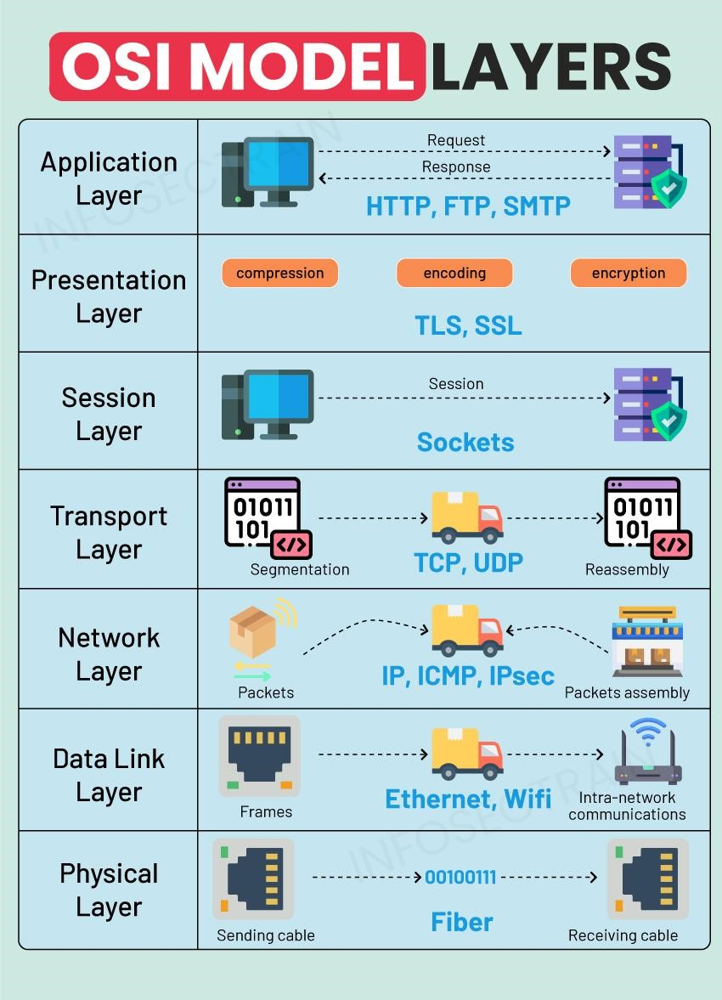
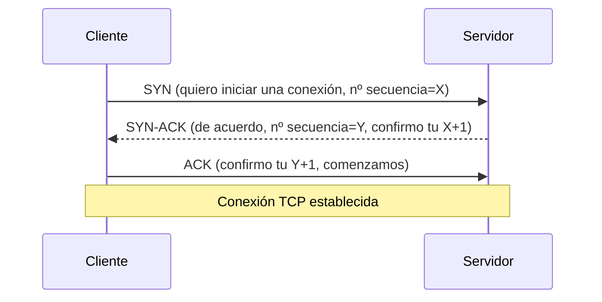
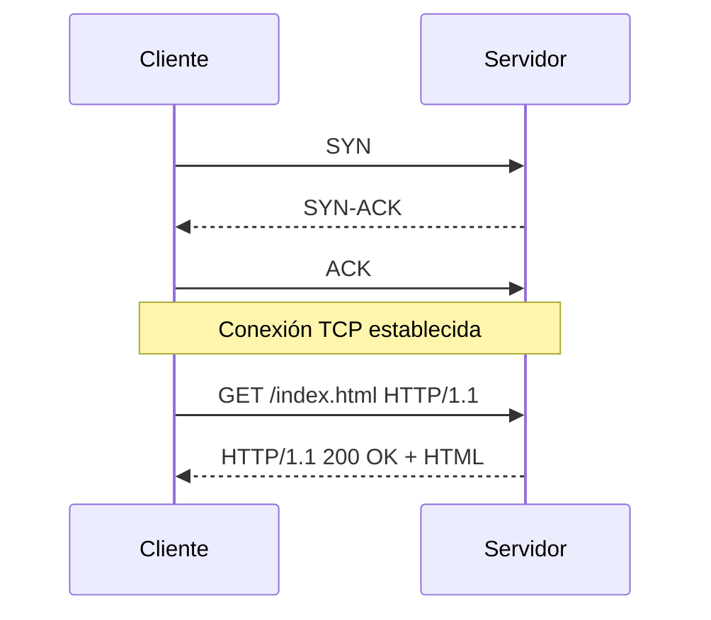
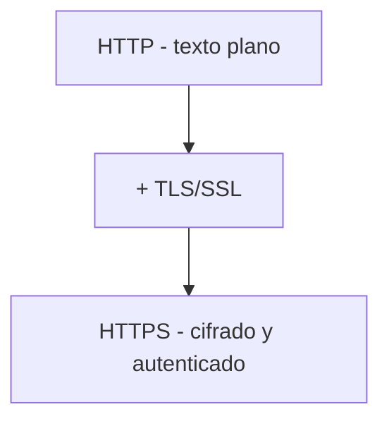
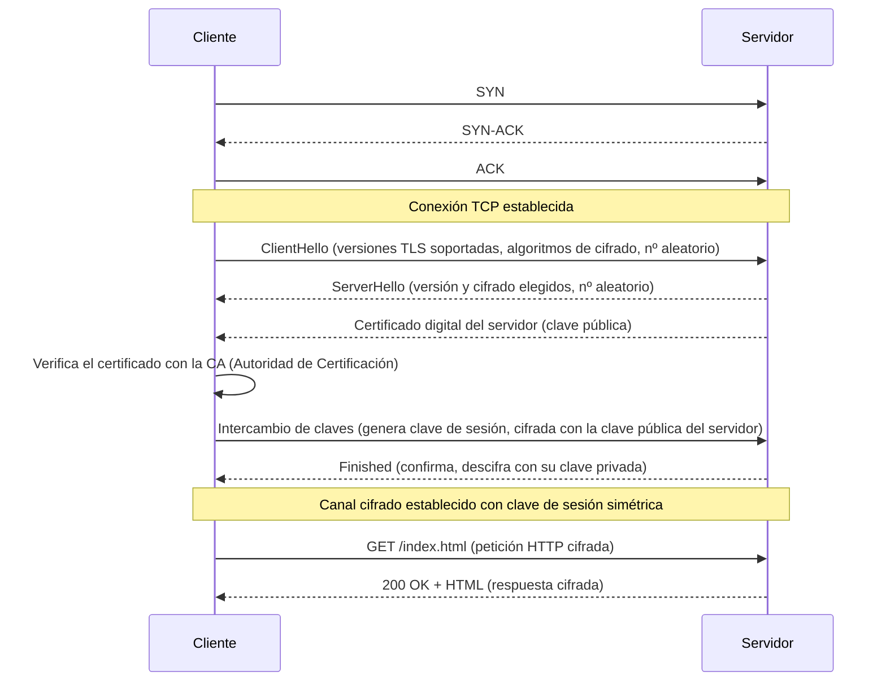

<!-- filepath: /home/lenovo-carles/GithubDAW/Apuntes-Despliegue-2. Dockerde-Aplicaciones-Web/docs/UD02 - Apache y Nginx/3. Protocolos de internet.md -->
# Protocolos de Internet: HTTP y HTTPS

Para que un cliente y un servidor puedan comunicarse es necesario que ambos "hablen el mismo idioma". Ese idioma es el **protocolo**. En el entorno web, los protocolos principales son **HTTP** y su versión segura, **HTTPS**.

## El modelo TCP/IP

Antes de llegar a HTTP, toda comunicación web viaja sobre el protocolo **TCP/IP**, que garantiza que los datos lleguen de forma fiable y ordenada entre dos máquinas.



### Establecimiento de una conexión TCP: el saludo de tres vías (*3-way handshake*)

Antes de enviar ninguna petición HTTP, el cliente y el servidor deben establecer una conexión TCP fiable mediante tres mensajes:



- **SYN** (*synchronize*): el cliente indica al servidor que quiere iniciar una conexión y le propone un número de secuencia inicial.
- **SYN-ACK**: el servidor confirma (*ACK*) la petición del cliente y, a su vez, propone su propio número de secuencia (*SYN*).
- **ACK** (*acknowledge*): el cliente confirma la respuesta del servidor. A partir de aquí la conexión queda establecida y pueden empezar a intercambiarse datos (peticiones HTTP).

## HTTP (HyperText Transfer Protocol)

HTTP es un protocolo de la **capa de aplicación**, de tipo **petición-respuesta**, sin estado (*stateless*): cada petición es independiente y el servidor no recuerda peticiones anteriores por sí mismo (para eso se usan cookies, sesiones, tokens...).

### Estructura de una petición HTTP

```text
GET /index.html HTTP/1.1
Host: www.ejemplo.com
User-Agent: Mozilla/5.0
Accept: text/html
```

- **Método**: acción que se desea realizar (`GET`, `POST`, `PUT`, `DELETE`...).
- **Ruta/recurso**: `/index.html`.
- **Versión del protocolo**: `HTTP/1.1`, `HTTP/2`, `HTTP/3`.
- **Cabeceras** (*headers*): metadatos sobre la petición.
- **Cuerpo** (*body*): opcional, usado en métodos como `POST` o `PUT`.

### Estructura de una respuesta HTTP

```text
HTTP/1.1 200 OK
Content-Type: text/html
Content-Length: 1234

<html>...</html>
```

- **Código de estado**: indica el resultado de la petición.
- **Cabeceras**: metadatos de la respuesta.
- **Cuerpo**: el contenido solicitado (HTML, JSON, imagen...).

### Principales métodos HTTP

| Método  | Descripción                          |
|---------|----------------------------------------|
| GET     | Solicita un recurso                    |
| POST    | Envía datos para crear un recurso      |
| PUT     | Actualiza un recurso existente         |
| DELETE  | Elimina un recurso                     |
| HEAD    | Igual que GET pero sin cuerpo de respuesta |
| OPTIONS | Consulta los métodos permitidos        |

### Principales códigos de estado

| Rango | Significado          | Ejemplos                      |
|-------|------------------------|---------------------------------|
| 1xx   | Informativo            | 100 Continue                    |
| 2xx   | Éxito                  | 200 OK, 201 Created              |
| 3xx   | Redirección            | 301 Moved Permanently, 304 Not Modified |
| 4xx   | Error del cliente      | 400 Bad Request, 404 Not Found   |
| 5xx   | Error del servidor     | 500 Internal Server Error        |

### Flujo completo de una petición HTTP



## ¿Por qué no es suficiente HTTP?

HTTP transmite la información **en texto plano**, sin cifrar. Esto significa que cualquiera que intercepte el tráfico (por ejemplo, en una red WiFi pública) podría leer:

- Credenciales de acceso (usuario/contraseña).
- Datos personales o bancarios.
- Cookies de sesión (pudiendo suplantar al usuario).

Además, no hay forma de verificar que el servidor al que nos conectamos es realmente quien dice ser (riesgo de ataques de suplantación, *man-in-the-middle*).

## HTTPS (HTTP Secure)

**HTTPS** es el protocolo HTTP combinado con una capa de **cifrado y autenticación** proporcionada por **SSL/TLS** (*Secure Sockets Layer* / *Transport Layer Security*). TLS es la evolución moderna de SSL (hoy en día se usa TLS, aunque popularmente se sigue hablando de "SSL").

HTTPS proporciona tres garantías fundamentales:

1. **Confidencialidad**: los datos viajan cifrados, nadie puede leerlos aunque los intercepte.
2. **Integridad**: se garantiza que los datos no han sido alterados durante la transmisión.
3. **Autenticación**: se verifica mediante **certificados digitales** que el servidor es quien dice ser.



### ¿Qué es un certificado digital?

Un **certificado digital (X.509)** es un documento electrónico emitido por una **Autoridad de Certificación (CA)** que vincula una clave pública con la identidad de una organización/dominio (por ejemplo, `www.ejemplo.com`). El navegador confía en las CAs reconocidas y, por tanto, confía en los certificados que estas emiten.

### Funcionamiento de SSL/TLS: el *handshake* TLS

Después de establecerse la conexión TCP (SYN, SYN-ACK, ACK), si la conexión es HTTPS se realiza además un **saludo TLS (TLS Handshake)** antes de poder enviar la petición HTTP:



Explicación de cada paso:

1. **ClientHello**: el cliente propone qué versiones de TLS y algoritmos de cifrado soporta, y envía un número aleatorio.
2. **ServerHello**: el servidor elige la versión y el algoritmo de cifrado a usar, y envía su propio número aleatorio.
3. **Certificado**: el servidor envía su **certificado digital**, que incluye su **clave pública**.
4. **Verificación del certificado**: el cliente comprueba que el certificado ha sido emitido por una **CA de confianza** y que corresponde al dominio al que se está conectando.
5. **Intercambio de claves**: cliente y servidor acuerdan (mediante criptografía asimétrica, p. ej. Diffie-Hellman o RSA) una **clave de sesión simétrica**, que será la que realmente cifre los datos (es mucho más rápida que la criptografía asimétrica).
6. **Finished**: ambas partes confirman que a partir de ahora toda la comunicación irá cifrada con la clave de sesión acordada.
7. A partir de aquí, la **petición y respuesta HTTP** viajan completamente **cifradas** dentro del canal TLS establecido.

### Criptografía simétrica vs asimétrica (resumen)

| Tipo          | Claves                          | Velocidad | Uso en TLS                          |
|----------------|----------------------------------|-----------|----------------------------------------|
| Asimétrica     | Clave pública + clave privada    | Lenta     | Verificar identidad e intercambiar la clave de sesión |
| Simétrica      | Una única clave compartida       | Rápida    | Cifrar los datos durante toda la sesión |

### HTTP vs HTTPS: resumen

| Característica        | HTTP            | HTTPS                      |
|------------------------|-----------------|------------------------------|
| Puerto por defecto     | 80              | 443                          |
| Cifrado                | No              | Sí (TLS/SSL)                 |
| Autenticación servidor | No              | Sí (certificado digital)     |
| Integridad de datos    | No garantizada  | Garantizada                  |

En el siguiente apartado veremos cómo configurar un servidor **Apache** para servir contenido tanto por HTTP como por HTTPS.
