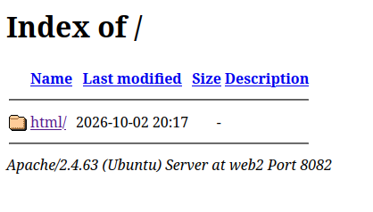

# Práctica 2

Para realizar ésta práctica se supone que ya tendréis disponible la máquina virtual con debian mínimo de la práctica 1.

## 1. Realizar conexión mediante SSH al servidor

Instala en el servidor `openssh-server` haciendo:

```bash
sudo apt update
sudo apt install openssh-server
```

Para verificar que está funcionando haz `sudo systemctl status ssh`. Debería aparecer active(running).

!!! Note Nota
    En el caso real en el que se trabajaría con un servidor con una ip asignada dentro de la red se hallaría la ip mediante `ip a` y se conectaría mediante `ssh <usuario>@<ip>`. En éste caso, hemos establecido que se utilizará NAT, por lo que son redes privadas y el procedimiento es el que se indica a continuación.

Para conectarnos con el servidor desde nuestro equipo haremos `ssh <tu_usuario>@127.0.0.1 -p 2222`.

## 2. Configuración básica de Apache

A partir de tener la conexión con el servidor mediante ssh, haremos el resto de pasos desde nuestro local.

### 1. Instalación de Apache

Hay dos modos de instalar apache: mediante el sistema de paquetes predeterminado de Linux (apt) o descargando su código fuente, descomprimiendo el paquete en `/usr/local/src` compilándolo y instalándolo. 

Por simplicidad haremos la instalación desde apt, pero cambe destacar que la instalación a partir de su código fuente permite la configuración de la misma.

```bash
sudo apt update
sudo apt install apache2 -y
```

Verifica el estado

### 2. Html de Apache2

Una vez instalado Apache en el servidor, desde nuestro cliente podremos acceder a la web por defecto de Apache accediendo a 127.0.0.1:8080.

La web utiliza `/var/www/html` como repositorio. Inspecciona el repositorio. 

Para que todos los usuarios puedan modificar los archivos de dentro de `/var/www/html` sin utilizar `sudo` puedes dar permisos a todos los usuarios con:

```bash
sudo chmod 777 –R /var/www/html
```

!!! note **Nota**
    Recuerda que el al hacer `chmod 777` lo que hacemos es dar permisos de **Lectura (4) + Escritura (2) + Ejecución (1) = 7** al `<propietario><grupo><otros>`.

!!! warning **IMPORTANTE**
    Esto se puede hacer solo en un entorno de desarrollo. En un entorno de producción nunca asignes permisos completos a todos los usuarios.

### 3. Configuración de Apache

La configuración de apache se hace en los archivos de texto encontrados en `/etc/apache2/`.

Inspeccionando los archivos podemos ver la siguiente estructura:

```bash
-rw-r--r-- 1 root root  7178 Jun 11 14:28 apache2.conf
drwxr-xr-x 2 root root  4096 Sep 30 12:02 conf-available
drwxr-xr-x 2 root root  4096 Sep 30 12:02 conf-enabled
-rw-r--r-- 1 root root  1782 Jun 11 14:28 envvars
-rw-r--r-- 1 root root 31063 Dec  5  2025 magic
drwxr-xr-x 2 root root 12288 Sep 30 12:02 mods-available
drwxr-xr-x 2 root root  4096 Sep 30 12:02 mods-enabled
-rw-r--r-- 1 root root   274 Jun 11 14:28 ports.conf
drwxr-xr-x 2 root root  4096 Sep 30 12:02 sites-available
drwxr-xr-x 2 root root  4096 Sep 30 12:02 sites-enabled
```

#### Archivos de configuración

- **apache2.conf**: Es el archivo de configuración principal del servidor. En este archivo se gestionan las **rutas, procesos, límites y logs** del servidor, además de incluir el resto de archivos.

- **ports.conf**: Define los **puertos de red y direcciones IP** en los que el servidor escucha las peticiones entrantes (por ejemplo, en el puerto `80` escucha peticiones HTTP y en el `443` peticiones HTTPS)

- **envvars**: Contiene variables de entorno del SO que Apache utiliza al arrancar. 

- **magic**: Define reglas para que Apache determine el **tipo MIME** de un archivo analizando solo sus primeros bytes, en lugar de guiarse por su extensión.

#### Directorios available-enabled

Los directorios dentro de esta carpeta contienen parejas de funcionalidades con el sufijo `*-available` o `*-enabled` que tienen como finalidad permitir **activar o desactivar sitios web y configuraciones de Apache sin eliminar archivos de configuración**. 

El funcionamiento es sencillo, en los archivos dentro de `*-available` guardas **todos los archivos de configuración / sitio web etc.** y después en el respectivo `*-enabled` haces un enlace simbólico que apunta a los archivos de `*-available` que quieres activar. 

Los directorios que encontramos són:

- **sites-available/ y sites-enabled/**: 
    - **sites-available**: Aloja los archivos de cada **sitio web** o **VirtualHost** alojado en el servidor
    - **sites-enabled**: Contiene enlaces que apuntan a `sites-available` y activa sitios web con las herramientas `a2ensite` (Apache 2 Enable Site) y `a2dissite` (Apache 2 Disable Site).

- **mods-available/ y mods-enabled/**:
    Apache tiene una estructura modular que permite añadir funcionalidades específicas al servidor web a través de módulos. Por ejemplo, si se quiere permitir conexiones seguras mediante HTTPS y gestionar certificados TLS/SSL se tiene el módulo `mod_ssl`. Si se quiere reescribir URLs para hacerlas más amigables se tiene el módulo `mod_rewrite`. Si se quiere poder ejecutar archivos `.php` desde el servidor sin necesidad de comunicarse con un programa externo se puede habilitar `mod_php`, que permite ejecutar el código dinámico utilizando el motor interno de PHP y generando el HTML resultante que envía al usuario.
        
    De la misma manera que en `sites-*`, en **mods-available** se tienen las configuraciones de los módulos de apache y en **mods-enabled** están los enlacs simbólicos que apuntan a **mods-enabled**. La herramienta que usa es `a2enmod` y `a2dismod`.

- **conf-availble/ y conf-enabled/**:
    - **conf-available**: Guarda fragmentos de configuración general que no corresponden directamente a un módulo concreto, como reglas de seguridad globales, páginas de error personalizadas etc.
    - **conf_enabled**: Contiene enlaces simbólicos a **conf-available**. Se gestiona con `a2enconf` y `a2disconf`.

Modifica el archivo **/etc/apache2/apache2.conf**. Para hacerlo, ántes haz una copia de seguridad (tendrás que usar `sudo` para poder ejecutar `cp` y guardarlo como `apache2.bak`). Después, edita el archivo `apache2.conf` con `sudo nano /etc/apache2/apache2.conf`.

Busca las líneas **IncludeOptional**. Debería aparecer:
```
IncludeOptional mods-enabled/*.load
IncludeOptional mods-enabled/*.conf
Include ports.conf
```
Lo que hacen estas líneas es modularizar el archivo de configuración, actuando como una especie de enlace con los archivos de la derecha de la instrucción (`mods-enabled/*.load` por ejemplo). De ésta manera, si nosotros modificamos el archivo `ports.conf`, en el archivo `apache2.conf` se cargará la versión actualizada.

#### Añadir puertos de escucha.

En ésta sección añadiremos un nuevo puerto de escucha a nuestro servidor, es decir, que además del puerto `80` el servidor recibirá peticiones de otro puerto (en éste caso el `12345`)

En tu VM, añade otra regla de redirección de puertos que haga que el puerto `12345` de la MV se pase al puerto `8081` de nuestro equipo en la IP `127.0.0.1` y reinicia la máquina.

!!! tip 
    **sudo reboot**

A continuación, abre el archivo `/etc/apache2/ports.conf` y añade el puerto `12345` a los puertos de escucha. 

!!! warning Importante
    Para aplicar los cambios en cualquier archivo de **configuración** de apache es necesario reiniciar el servidor. Ésto se puede hacer con:
    `sudo systemctl reload apache2`. 

    Los cambios en los **archivos de repositorio** (.html, .php etc.) no requieren reiniciar el servidor.

Si has realizado bien el cambio, aparecerá la misma página que en `127.0.0.1:8080`.

!!! tip 
    Para verificar el estado de **apache2** puedes hacer `sudo systemctl status apache2`

#### Cambiar la prioridad de la extensión

El módulo que se encarga de decir qué archivo se debe devolver cuando se hace una petición a un directorio es `dir.conf`. Si vemos los contenidos de `mod-enabled/dir.conf` veremos algo así:

`DirectoryIndex index.html index.cgi index.pl index.php index.xhtml index.htm`


!!! example Ejemplo
    Cuando el usuario hace una petición a `http://tudominio.com/tienda/`, apache buscará en la carpeta `/var/www/html/tienda/` el archivo `index.html`. Si no encuentra ninguno, entonces devolverá `index.cgi`, si no encuentra hará `index.pl` y así sucesivamente. Si modificamos el órden de los archivos y ponemos primero `index.php`, apache buscará primero el archivo `index.php` y si no lo encuentra seguirá con el resto.


!!! danger Cuidado
    La modificación de los archivos dentro de **mod-enabled** es algo delicado y hay que hacerlo siempre con mucho cuidado.


### 4. VirtualHosts

Como hemos visto, un servidor web tiene un único repositorio ( **/var/www/html** ) donde buscar los recursos de los clientes, por lo que un servidor sólo servirá a una aplicación, ya que si ponemos los archivos de dos aplicaciones web diferentes en un mismo repositorio, ¿cómo va a diferenciar el servidor a qué aplicación pertenece qué archivo?

Sin embargo, podemos querer tener múltiples aplicaciones alojadas en el mismo servidor, ya que, si nuestra aplicación web no es demasiado grande, no consumirá todos los recursos del servidor.

Para solucionar ésto, apache permite configurar **Virtual Hosts**, que básicamente lo que hace es leer la petición de llegada, identificar el nombre de dominio (`misitio2.com` por ejemplo) o la dirección `IP` y dirigir al usuario a la carpeta correcta donde se encuentran los archivos de esa aplicación.

La configuración del **VirtualHost** tiene los siguientes tres pasos:
- Configurar el DNS
- Crear y editar el archivo de configuración
- Activar el host virtual

#### Configurar DNS
En el entorno de producción, para configurar el DNS tendríamos que acceder a nuestro VPS, ir al Panel de Gestión DNS y crear los Registros DNS necesarios.

En nuestro casso, estamos trabajando con un entorno de desarrollo, por lo que *"engañaremos"* a nuestro equipo modificando el archivo local de DNS **/etc/hosts**. Éste archivo consiste en la relación entre:

[IP] <---- [DOMINIO]

!!! Example Ejemplo
    Si añadimos la línea:
    **127.0.0.1 miweb.com**
    Al buscar en el navegador miweb.com la petición irá a 127.0.0.1, que es la url de *loopback*.

!!! Tip 
    Puedes usar `wget` sin descargar los archivos de la web con los tags -qO-. 
    Por ejemplo, `wget -qO- 127.0.0.1:80`.

#### Configuración en Apache
Apache tiene un archivo de configuración de host virtual **000-default.conf** dentro de la carpeta **sites-available**. Para trabajar con el, haremos una copia y luego modificaremos el nuevo archivo. Por ejemplo: 

```bash
cd /etc/apache2/sites-available
sudo cp 000-default.conf 1-virtualhost.conf
sudo nano 1-virtualhost.conf
```

El archivo de configuración incluye la configuración del VirtualHost.

```html
<VirtualHost *:80>
    # 1. El dominio que vas a escuchar
    ServerName miempresa.com 
    ServerAlias www.miempresa.com

    # 2. El email del administrador
    ServerAdmin admin@miempresa.com

    # 3. La carpeta física donde están los archivos del proyecto
    DocumentRoot /var/www/mi-sitio/public

    # 4. Logs independientes para este sitio
    ErrorLog ${APACHE_LOG_DIR}/mi-sitio-error.log
    CustomLog ${APACHE_LOG_DIR}/mi-sitio-access.log combined
</VirtualHost>
```
Aquí estableces qué nombres de server van a buscar info a qué carpeta. Por ejemplo, cuando al servidor le llegue una petición al puerto 80 con la url miempresa.com o www.miempresa.com buscará en la carpeta /var/www/mi-sitio/public los archivos.

!!! warning peligro
    La configuración por defecto de los directorios se encuentra dentro de **/etc/apache2/apache.conf**. Dentro de los tags `<Directory /var/wwww>` encontramos la configuración del directorio donde se encuentran los archivos de nuestra web. La opción **Indexes** lo que hace es que cuando no se encuentre el archivo predeterminado `index.html` apache mostrará un índice con los archivos del directorio. Ésto puede ser un problema de seguridad. 

Para modificar la configuración del directorio únicamente en nuestro VirtualHost manteniendo la configuración global, lo que haremos será añadir al archivo de configuración `/etc/apache2/sites-available/1-virtualhost.conf` la configuración del directorio eliminando la opción Index. También se puede establecer aquí si el index en el directorio tiene otro nombre con DirectoryIndex 

```html
<VirtualHost *:80>	
	ServerName web1
	ServerAlias www.pagina1.com
	ServerAdmin webmaster@localhost
	DocumentRoot <ruta-al-directorio>
</VirtualHost>
<Directory <ruta-al-directorio>>
	Options FollowSymLinks
    DirectoryIndex miindex.html
	AllowOverride None
	Require all granted	
</Directory>
```

Una vez se tiene toda la configuración del VirtualHost, sólo queda activarlo haciendo `sudo a2ensite 1-virtualhost.conf` y a continuación reiniciar el servicio haciendo `service apache2 reload`.