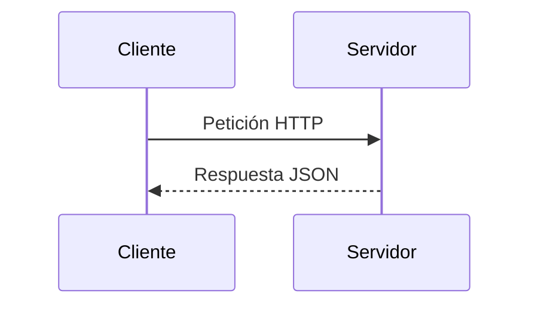

<!-- filepath: /home/lenovo-carles/GithubDAW/Apuntes-Despliegue-de-Aplicaciones-Web/docs/UD5 - Documentación/4. Formatos de documentación.md -->
# Formatos de documentación

La documentación de una aplicación web puede presentarse en distintos formatos según su finalidad y el público al que va dirigida.

## Markdown

Formato de texto plano con sintaxis sencilla, muy utilizado en repositorios de código (README, wikis de GitHub/GitLab) y generadores de sitios estáticos como MkDocs.

```markdown
# Título
## Subtítulo
- Elemento de lista
**Negrita** y *cursiva*
```

Ventajas: legible en texto plano, fácil de versionar con Git, soportado de forma nativa por plataformas como GitHub/GitLab.

## reStructuredText (reST)

Formato similar a Markdown pero más potente, utilizado principalmente en el ecosistema Python (Sphinx).

## HTML

Formato final de salida de muchos generadores de documentación (Javadoc, JSDoc, MkDocs, Sphinx...). Permite navegación, enlaces, búsqueda y estilos.

## PDF

Formato adecuado para documentación formal, manuales de usuario o entregables que deben imprimirse o archivarse de forma inmutable. Se puede generar a partir de Markdown/LaTeX mediante herramientas como `pandoc`.

```bash
pandoc manual.md -o manual.pdf
```

## Wiki

Formato colaborativo basado en páginas enlazadas entre sí, editable por varios usuarios (MediaWiki, wikis de GitHub/GitLab). Ideal para documentación viva que cambia con frecuencia.

## Diagramas (UML, Mermaid, PlantUML)

Permiten representar de forma gráfica arquitecturas, flujos y relaciones entre componentes.



## Comparativa de formatos

| Formato      | Uso principal                         | Ventajas                       |
|--------------|-----------------------------------------|----------------------------------|
| Markdown     | README, wikis, MkDocs                  | Simple, versionable              |
| reST         | Documentación técnica Python (Sphinx)  | Potente, extensible              |
| HTML         | Salida navegable de documentación      | Interactivo, enlazable           |
| PDF          | Manuales formales, entregas             | Portable, imprimible             |
| Wiki         | Documentación colaborativa viva        | Fácil edición entre varios autores |
| Diagramas    | Arquitectura y flujos                  | Representación visual clara      |

La elección del formato dependerá del **público objetivo**, el **ciclo de vida** del documento y la **herramienta de generación** utilizada.
